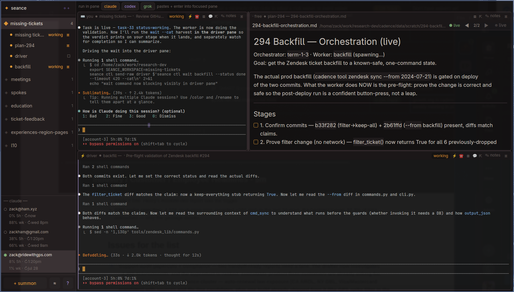

# seance

**A shared space where humans and agents work together, live.**

Seance is a candlelit multi-pane terminal for Linux. Every pane is on the
human’s screen. Agents (Claude, Codex, Grok, any CLI) and shells sit beside
you — not hidden in a background job. They can see each other, ask you
questions, propose commands for your approval, and leave notes on a scratchpad
you both flip into. Visibility is the point.

Native app on [GPUI](https://www.gpui.rs/). Sessions live in a long-lived
daemon; the window is disposable.



**License:** MIT · **Platform:** Linux (Wayland / X11) · **Status:** 0.9.16

Release notes: [`CHANGELOG.md`](CHANGELOG.md).

## Why it exists

Most agent tooling optimizes for *the agent alone*. Seance optimizes for
**engagement in a shared space**:

| human | agent |
|-------|--------|
| watches every pane live | runs in a real terminal on that screen |
| flips notes, steers, takes over a shell | drives siblings via `seance ctl` |
| answers `ask` toasts; Enter/Esc on ghost commands | prefers `propose` over silent risk |
| triages by status badges + stage strip | reports `planning` / `working` / `needs-human` |
| inspects pad drawer without flipping | opens file panes so edits appear live |

Attribution is first-class: actions are logged as `human` / `agent:<pane>` /
`cli`. The timeline answers “what happened while I was looking elsewhere?”

Any command is a pane. Default summon is a **shell** (so you can always take
the keyboard). Point `--command` at whatever agent CLI you use.

## Features

- **Live multi-pane terminals** — real PTYs, selection, scrollback; weighted tile grid with drag sashes (n≥2)
- **Workspaces** — keep circles of work apart; sidebar drag-reorder
- **Notes on the back of every pane** — shared markdown (`$SEANCE_SCRATCHPAD`)
- **Pad drawer** — stage chip / ▤ shows task inject body + pad tail (live-refreshes)
- **Stage strip** — urgency-sorted roster chips (click focus+pad, double-click zoom)
- **File panes** — live markdown/text + history/diff when co-editing
- **Control plane** — `seance ctl` so any pane (or external script) can spawn, send, wait, harvest
- **Orchestrator A+** — `--agent` profiles, evidence-bound `wait --status done`, `send --file`, task envelopes, `harvest`, event-driven wait, boot-clear
- **Human-in-the-loop** — `ask`, `propose`, seize/release/drive
- **Phone a pane** — ☎ / `ctl phone` opens a telegram topic and seeds a **stage card** (workspace, roster, ctl how-to). No participant claim — you drive panes with normal `seance ctl` on this host. Optional needs-human one-liners post to the topic when linked.
- **Daemon architecture** — upgrade binary without killing the circle (concurrent-upgrade gate)
- **Event bus** — sequenced, attributable events + `seance ctl watch`
- **Capabilities** — `policy open|propose_required|locked` + per-principal grants

## Quick start

```bash
./scripts/bootstrap-deps.sh    # pinned gpui checkout — see docs/PLAYBOOK.md
cargo build --release          # first build can take ~10 min
./target/release/seance

ln -sf "$(pwd)/target/release/seance" ~/.local/bin/seance   # optional
```

Requirements: recent Rust, Vulkan-capable drivers, a monospace font
(default *CaskaydiaMono Nerd Font Mono* — change in `src/term_font.rs`).

```bash
seance ctl skill                 # agent-facing protocol (⚡ arm / paste)
seance ctl doctor
seance ctl roster
seance ctl new --name w --agent claude --wait-ready
seance ctl send w --file /tmp/task.md
seance ctl wait w --status done --timeout 600 --cat
seance ctl harvest w1 w2 w3 --timeout 900
seance ctl phone w               # telegram topic + stage card (no claim)
```

Multi-agent live test: `./scripts/agent-collab-test.sh`  
Thorough smoke: `./scripts/e2e-thorough.sh`  
Upgrade load test: `./scripts/upgrade-load-test.sh` (upgrades live daemon)

## Keybinds

| key | action |
|-----|--------|
| ctrl+shift+n | new pane (shell by default) |
| ctrl+shift+w | banish (kill) active pane |
| ctrl+shift+s | flip notes ↔ face |
| ctrl+shift+p | pop pane to its own window |
| ctrl+shift+k | precanned prompt palette |
| ctrl+shift+j | fuzzy jump (pane / workspace) |
| ctrl+shift+z | focus-zoom active pane |
| ctrl+shift+f | last failed shell command |
| ctrl+pageup / pagedown | cycle workspaces |
| ctrl+shift+pageup / pagedown | cycle panes in this workspace |
| ctrl+shift+v | paste |
| ctrl+click / middle-click | open OSC-8 / URL |
| stage chip click | focus + pad drawer |
| stage chip double-click | zoom |
| ⚡ | arm agent (`ctl skill` orientation) |
| ☎ | phone pane (telegram stage card) |
| ▤ | pad drawer |
| sash drag | resize 2-pane ratio or multi-pane weights |

## Architecture (short)

| process | role |
|---------|------|
| `seance daemon` | owns PTYs, grids, state; Unix socket |
| `seance` (GUI) | shared space UI; reconnects safely |
| `seance ctl …` | JSON-lines client for agents, shells, scripts |

**Do not** `pkill -x seance` to reload — that kills every session. Prefer
`cargo build --release && seance upgrade`, or `seance restart-gui` for UI-only.

| path | |
|------|--|
| state | `~/.local/share/seance/state.json` |
| scratchpads | `~/.local/share/seance/scratch/<slug>.md` |
| layout weights | `~/.local/share/seance/layout.json` |
| events | `~/.local/share/seance/events.jsonl` |
| socket | `$XDG_RUNTIME_DIR/seance.sock` |

Injected into every pane: `SEANCE_SESSION`, `SEANCE_WORKSPACE`,
`SEANCE_SCRATCHPAD`, `SEANCE_SOCKET`. Workspace scoping is automatic inside a
pane — agents only see their circle unless you pass `--all`.

## Docs

| doc | |
|-----|--|
| [docs/CONTROL.md](docs/CONTROL.md) | control plane + how agents engage the human |
| [docs/DAEMON.md](docs/DAEMON.md) | daemon / GUI split, upgrade path |
| [docs/ORCHESTRATION.md](docs/ORCHESTRATION.md) | multi-agent swarm playbook |
| [docs/SHELL-INTEGRATION.md](docs/SHELL-INTEGRATION.md) | structured command boundaries |
| [docs/PERF-TERMINAL.md](docs/PERF-TERMINAL.md) | multi-pane paint notes |
| [CLAUDE.md](CLAUDE.md) | notes for coding agents working *on* this repo |

Canonical agent instructions: **`seance ctl skill`**.

## Develop

```bash
./scripts/bootstrap-deps.sh
cargo test
cargo build --release && seance upgrade
./scripts/e2e-thorough.sh
```

Pin discipline: `gpui-component` rev-pinned; zed patched to `deps/zed` at
`1a246efd…`. Bump only as a pair — PLAYBOOK.

## Not yet

- OSC-133 shell-agnostic markers (bash hooks + cmdlog work today; OSC-8 open shipped)
- **Full continuous session replay** (grid recorder + browser player) — filed in vita
  working doc; not the retired timeline HTML export
- GPU glyph atlas (CPU path is multi-pane smooth — explicit non-goal for now)
- worktree-backed agent rooms, best-of-N

## License

MIT — see [LICENSE](LICENSE).

Uses [zed’s alacritty fork](https://github.com/zed-industries/alacritty)
(Apache-2.0), [GPUI](https://www.gpui.rs/), and
[gpui-component](https://github.com/longbridge/gpui-component).
