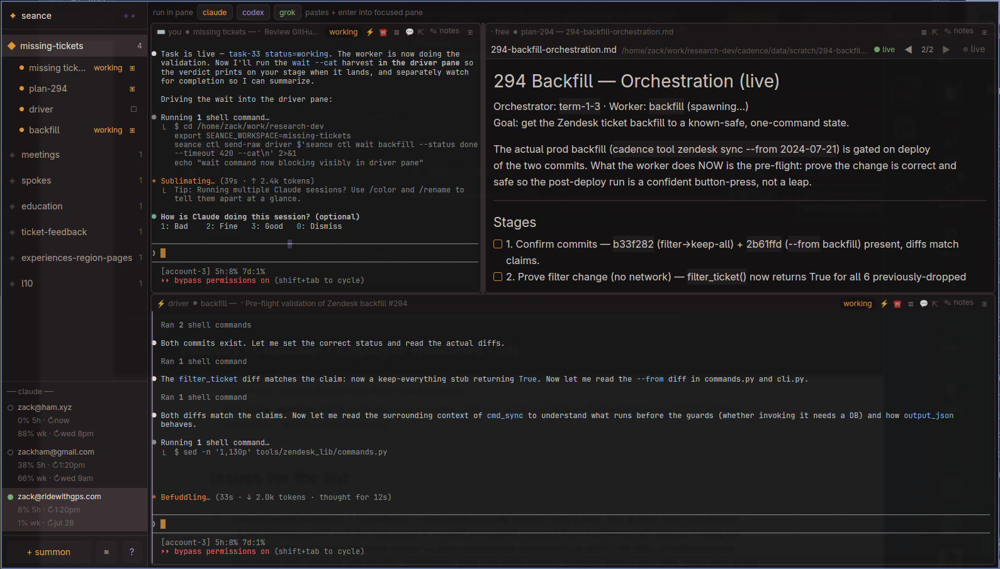

# seance

**A shared space where humans and agents work together, live.**

Seance is a candlelit multi-pane terminal for Linux. Every pane is on the
human’s screen. Agents (Claude, Codex, Grok, any CLI) and shells sit beside
you — not hidden in a background job. They can see each other, ask you
questions, propose commands for your approval, and leave notes on a scratchpad
you both flip into. Visibility is the point.

Native app on [GPUI](https://www.gpui.rs/). Sessions live in a long-lived
daemon; the window is disposable.



**License:** MIT · **Platform:** Linux (Wayland / X11) + macOS thin client · **Status:** 0.25.2

Release notes: [`CHANGELOG.md`](CHANGELOG.md).

**New in 0.14**: **the PR board** — one **PRs (N)** button in the sidebar opens
a circle-first sweep of every PR the daemon knows: needs-first sections, each
row `repo#N` with draft / CI / review glyphs, age, last review or comment, and
a *push or close* mark once it's gone quiet. Click a row to open the PR, a
section header to jump to that circle. Hover a row — in the board or the chip
popover — and a **✕** drops that one ref for good: the removal is remembered
per circle, so the next pane repaint can't scrape it back. The watcher now supplies structured
state (draft, CI pass/fail/running, review required/approved/changes,
open/review/comment times) instead of one label string, a verdict *change*
bumps the circle's recency clock, and chips lead with the repo name.
(0.13: **PR links** — GitHub PR URLs scraped straight out of pane output,
mapped onto circle attention by an external watcher (`pr_watch.json`).
See [docs/CONTROL.md](docs/CONTROL.md), [docs/DAEMON.md](docs/DAEMON.md).)

## Why it exists

Most agent tooling optimizes for *the agent alone*. Seance optimizes for
**engagement in a shared space**:

| human | agent |
|-------|--------|
| watches every pane live | runs in a real terminal on that screen |
| flips notes, steers, takes over a shell | drives siblings via `seance ctl` |
| answers `ask` toasts; Enter/Esc on ghost commands | prefers `propose` over silent risk |
| triages by status badges + stage strip | reports `planning` / `working` / `needs-human` |
| inspects pad drawer without flipping | opens file panes so edits appear live |

Attribution is first-class: actions are logged as `human` / `agent:<pane>` /
`cli`. The timeline answers “what happened while I was looking elsewhere?”

Any command is a pane. Default summon is a **shell** (so you can always take
the keyboard). Point `--command` at whatever agent CLI you use.

## Features

- **Live multi-pane terminals** — real PTYs, selection, scrollback; weighted tile grid with drag sashes (n≥2)
- **Workspaces** — keep circles of work apart; sidebar drag-reorder
- **Notes on the back of every pane** — shared markdown (`$SEANCE_SCRATCHPAD`)
- **Pad drawer** — stage chip / ▤ shows task inject body + pad tail (live-refreshes)
- **Stage strip** — urgency-sorted roster chips (click focus+pad, double-click zoom)
- **File panes** — live markdown/text + history/diff when co-editing
- **Control plane** — `seance ctl` so any pane (or external script) can spawn, send, wait, harvest
- **Orchestrator A+** — `--agent` profiles, evidence-bound `wait --status done`, `send --file`, task envelopes, `harvest`, event-driven wait, boot-clear
- **Human-in-the-loop** — `ask`, `propose`, seize/release/drive
- **Phone a pane** — ☎ / `ctl phone` opens a telegram topic and seeds a **stage card** (workspace, roster, ctl how-to). No participant claim — you drive panes with normal `seance ctl` on this host. Optional needs-human one-liners post to the topic when linked.
- **Browser thin client** — `seance web` serves a wasm/WebGL2 client with native-parity chrome over a token-authed websocket
- **Session replay** — always-on 48h DVR; prompt-chapter player, trim/publish editor, shareable static bundles
- **Daemon architecture** — upgrade binary without killing the circle (concurrent-upgrade gate)
- **Event bus** — sequenced, attributable events + `seance ctl watch`
- **Capabilities** — `policy open|propose_required|locked` + per-principal grants

## Quick start

```bash
./scripts/bootstrap-deps.sh    # pinned gpui checkout — see docs/PLAYBOOK.md
cargo build --release          # first build can take ~10 min
./target/release/seance

ln -sf "$(pwd)/target/release/seance" ~/.local/bin/seance   # optional
```

Requirements: recent Rust, Vulkan-capable drivers, a monospace font
(default *JetBrainsMono Nerd Font* — change in `src/term_font.rs`).

On **macOS** (thin client against a remote daemon — see
[docs/REMOTE.md](docs/REMOTE.md)), `./scripts/bundle-macos.sh` is the build
command: it wraps the binary in `/Applications/Seance.app` so it launches from
Finder, Spotlight and the Dock. `--user` installs to `~/Applications`,
`--no-build` bundles what's already built. The bundle holds a *copy* of the
binary, so re-run the script rather than a bare `cargo build --release`.

```bash
seance ctl skill                 # agent-facing protocol (⚡ arm / paste)
seance ctl doctor
seance ctl roster
seance ctl new --name w --agent claude --wait-ready
seance ctl send w --file /tmp/task.md
seance ctl wait w --status done --timeout 600 --cat
seance ctl harvest w1 w2 w3 --timeout 900
seance ctl phone w               # telegram topic + stage card (no claim)
```

Multi-agent live test: `./scripts/agent-collab-test.sh`  
Thorough smoke: `./scripts/e2e-thorough.sh`  
Upgrade load test: `./scripts/upgrade-load-test.sh` (upgrades live daemon)

## Claude Code hooks (status + toasts without arming)

Status chips, stage-strip urgency, and desktop toasts are **agent-reported** —
seance never guesses what an agent is doing. An un-armed agent reports
nothing, so a Claude launched by hand in a pane is invisible to attention
routing. For Claude Code you can make reporting automatic: every pane exports
`$SEANCE_SESSION`, and Claude Code hooks inherit it, so a tiny hook script
covers the whole turn lifecycle — no arming, nothing for the model to
remember, and a safe no-op outside seance.

```bash
#!/usr/bin/env bash
# ~/.local/bin/seance-claude-hook
[ -n "$SEANCE_SESSION" ] || exit 0
command -v seance >/dev/null 2>&1 || exit 0
case "$1" in
  working) seance ctl status-set working >/dev/null 2>&1 ;;
  stop)
    # Turn ended — your move. Toast only for panes you are NOT looking at;
    # the one on screen just flips its chip.
    f=$(seance ctl human --json 2>/dev/null | jq -r '.data.focused_pane // empty')
    if [ "$f" = "$SEANCE_SESSION" ]; then
      seance ctl status-set idle "turn ended" >/dev/null 2>&1
    else
      seance ctl status-set needs-human "turn ended — your move" >/dev/null 2>&1
    fi ;;
  needs-human)
    # Notification event (permission prompt / waiting on input); JSON on stdin.
    m=$(jq -r '.message // empty' 2>/dev/null)
    seance ctl status-set needs-human "${m:-claude needs attention}" >/dev/null 2>&1 ;;
esac
exit 0
```

```jsonc
// ~/.claude/settings.json
{ "hooks": {
  "UserPromptSubmit": [{ "hooks": [{ "type": "command", "command": "seance-claude-hook working" }] }],
  "PostToolUse":      [{ "hooks": [{ "type": "command", "command": "seance-claude-hook working" }] }],
  "Stop":             [{ "hooks": [{ "type": "command", "command": "seance-claude-hook stop" }] }],
  "Notification":     [{ "matcher": "", "hooks": [{ "type": "command", "command": "seance-claude-hook needs-human" }] }]
} }
```

`working` on prompt submit and tool use (the latter clears a `needs-human`
left by an approved permission prompt), `needs-human` — a desktop toast —
when a turn ends off-screen or Claude blocks on a permission, `idle` when the
turn ends in the pane you are watching. Arming (`⚡` / `ctl skill`) is still
worth it for pads, `finish`, `ask`, and `propose` — hooks just make the
attention routing free.

## Keybinds

| key | action |
|-----|--------|
| ctrl+shift+n | new pane (shell by default) |
| ctrl+shift+w | banish (kill) active pane |
| ctrl+shift+s | flip notes ↔ face |
| ctrl+shift+p | pin / unpin selected workspace |
| ctrl+shift+o | pop pane to its own window |
| ctrl+shift+k | precanned prompt palette |
| ctrl+shift+j | fuzzy jump (workspace) |
| ctrl+shift+z | focus-zoom active pane |
| ctrl+shift+space | overview (live map) |
| ctrl+shift+r | rename selected workspace |
| ctrl+shift+f | last failed shell command |
| ctrl+pageup / pagedown | cycle workspaces |
| ctrl+shift+pageup / pagedown | cycle panes in this workspace |
| ctrl+shift+v | paste |
| ctrl+click / middle-click | open OSC-8 / URL (ours → scry, rest → default browser) |
| mouse back / forward | walk the circles you've been in |
| stage chip click | focus + pad drawer |
| stage chip double-click | zoom |
| ⚡ | arm agent (`ctl skill` orientation) |
| ☎ | phone pane (telegram stage card) |
| ▤ | pad drawer |
| sash drag | resize 2-pane ratio or multi-pane weights |

## Architecture (short)

| process | role |
|---------|------|
| `seance daemon` | owns PTYs, grids, state; Unix socket |
| `seance` (GUI) | shared space UI; reconnects safely |
| `seance ctl …` | JSON-lines client for agents, shells, scripts |
| `seance web` | ws↔socket bridge + static client; browsers attach as GUI clients |

**Do not** `pkill -x seance` to reload — that kills every session. Prefer
`cargo build --release && seance upgrade`, or `seance restart-gui` for UI-only.

| path | |
|------|--|
| state | `~/.local/share/seance/state.json` |
| scratchpads | `~/.local/share/seance/scratch/<slug>.md` |
| layout weights | `~/.local/share/seance/layout.json` |
| rail arrangement | `~/.local/share/seance/subscriptions.json` (daemon-owned; every window shares it) |
| events | `~/.local/share/seance/events.jsonl` |
| socket | `$XDG_RUNTIME_DIR/seance.sock` |

Injected into every pane: `SEANCE_SESSION`, `SEANCE_WORKSPACE`,
`SEANCE_SCRATCHPAD`, `SEANCE_SOCKET`. Workspace scoping is automatic inside a
pane — agents only see their circle unless you pass `--all`.

## Docs

| doc | |
|-----|--|
| [docs/CONTROL.md](docs/CONTROL.md) | control plane + how agents engage the human |
| [docs/WEB.md](docs/WEB.md) | browser thin client (`seance web`): wasm renderer, ws bridge, token auth |
| [docs/REPLAY.md](docs/REPLAY.md) | session replay: 48h DVR, prompt-chapter player, trim/publish editor |
| [docs/DAEMON.md](docs/DAEMON.md) | daemon / GUI split, upgrade path |
| [docs/ORCHESTRATION.md](docs/ORCHESTRATION.md) | multi-agent swarm playbook |
| [docs/SHELL-INTEGRATION.md](docs/SHELL-INTEGRATION.md) | structured command boundaries |
| [docs/REMOTE.md](docs/REMOTE.md) | thin client against a remote daemon (ssh forward) |
| [docs/PERF-TERMINAL.md](docs/PERF-TERMINAL.md) | multi-pane paint notes (native + web) |
| [docs/THEME.md](docs/THEME.md) | candlelit palette, `SeancePalette` |
| [CLAUDE.md](CLAUDE.md) | notes for coding agents working *on* this repo |

Canonical agent instructions: **`seance ctl skill`**.

## Develop

```bash
./scripts/bootstrap-deps.sh
cargo test
cargo build --release && seance upgrade
./scripts/e2e-thorough.sh
```

Pin discipline: `gpui-component` rev-pinned; zed patched to `deps/zed` at
`1a246efd…`. Bump only as a pair — PLAYBOOK.

## Not yet

- OSC-133 shell-agnostic markers (bash hooks + cmdlog work today; OSC-8 open shipped)
- GPU glyph atlas **in the native app** (CPU path is multi-pane smooth — explicit
  non-goal for now; the web client is WebGL2 already)
- worktree-backed agent rooms, best-of-N

## License

MIT — see [LICENSE](LICENSE).

Uses [zed’s alacritty fork](https://github.com/zed-industries/alacritty)
(Apache-2.0), [GPUI](https://www.gpui.rs/), and
[gpui-component](https://github.com/longbridge/gpui-component).
